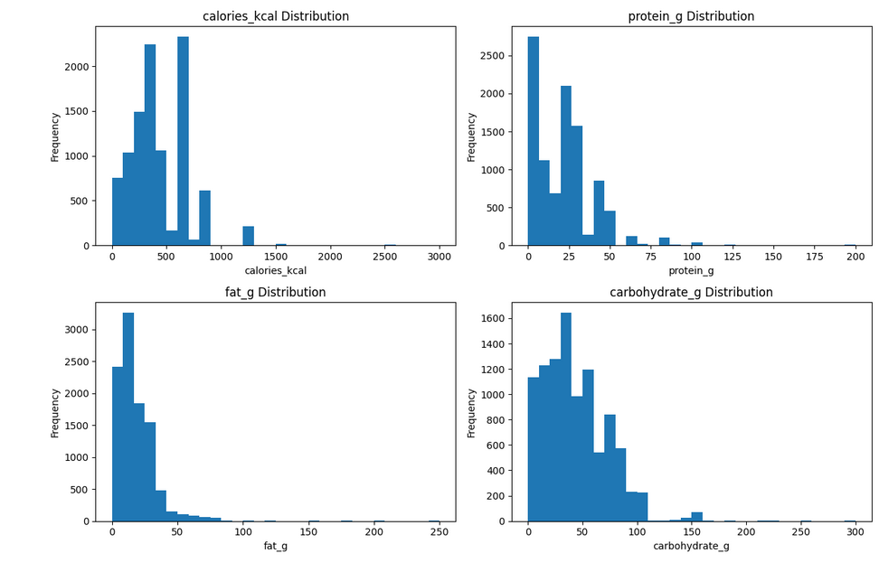
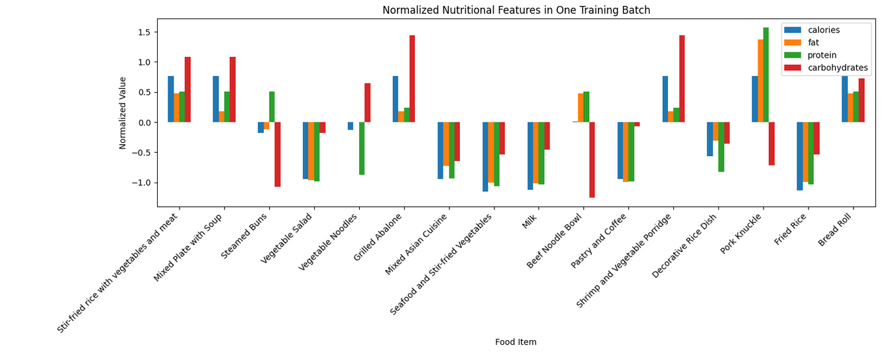
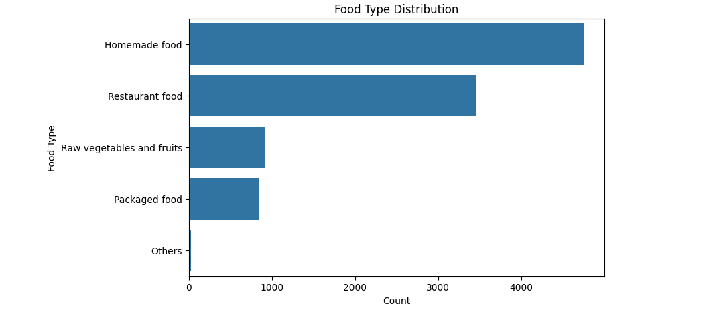
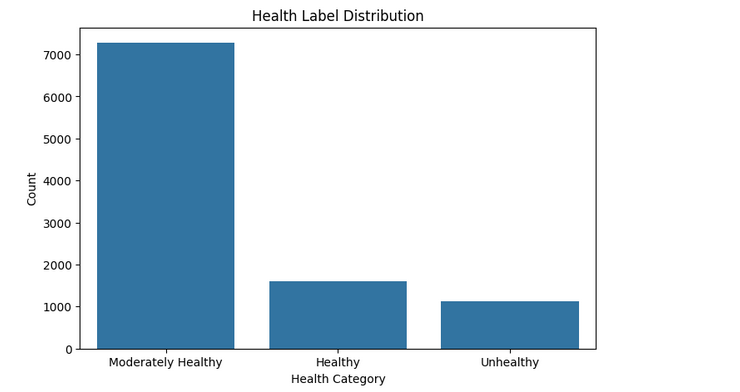
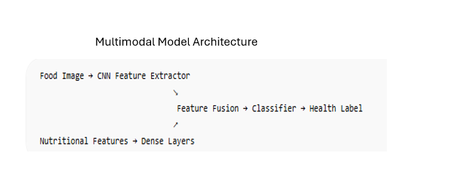
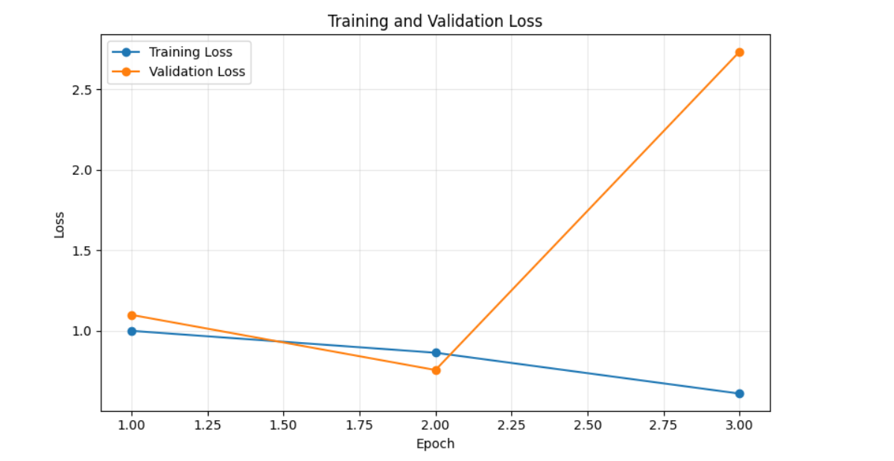
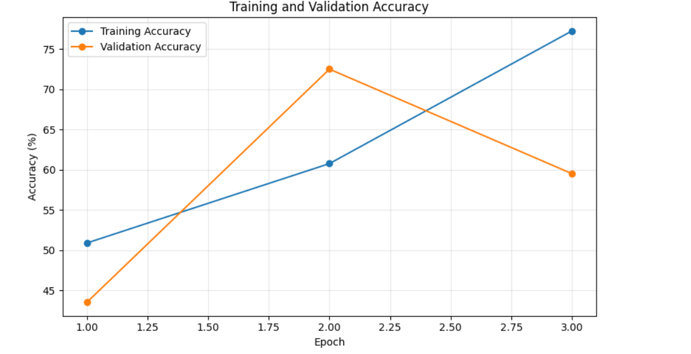
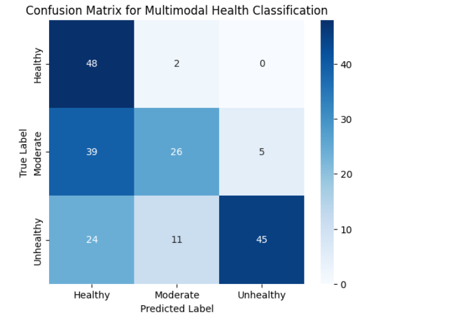
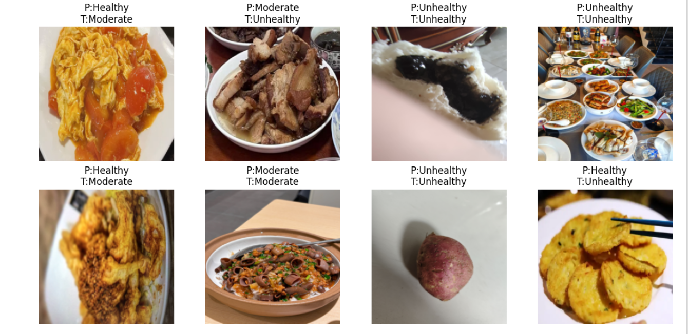

# Healthy Food Classification Using Multimodal Deep Learning


A multimodal deep learning framework that combines food image analysis with structured nutritional metadata for automated food-health classification using PyTorch.

---

## Table of Contents

- [Project Overview](#project-overview)
- [Project Highlights](#project-highlights)
- [Problem Statement](#problem-statement)
- [Objectives](#objectives)
- [Data Source] (#data-source) 
- [Dataset Description](#dataset-description)
- [Dataset Characteristics](#dataset-characteristics)
- [Technologies Used](#technologies-used)
- [Techniques Used](#techniques-used)
- [Multimodal Pipeline Workflow](#multimodal-pipeline-workflow)
- [Visualizations and Results](#visualizations-and-results)
- [Multimodal Model Architecture](#multimodal-model-architecture)
- [Training and Evaluation](#training-and-evaluation)
- [Evaluation Metrics](#evaluation-metrics)
- [Results Summary](#results-summary)
- [Key Contributions](#key-contributions)
- [Interactive Streamlit Application](#interactive-streamlit-application)
- [Project Structure](#project-structure)
- [Installation](#installation)
- [Usage](#usage)
- [Training Configuration](#training-configuration)
- [Limitations](#limitations)
- [Future Work](#future-work)
- [Final Conclusion](#final-conclusion)
- [Author](#author)
- [License](#license)

---

## Project Overview

This project presents a multimodal deep learning framework for automated food-health classification by combining food image analysis with structured nutritional metadata.

The proposed system integrates CNN-based visual feature extraction with tabular nutritional representations to classify food samples into:

- Healthy
- Moderately Healthy
- Unhealthy

The project demonstrates how multimodal AI/ML architectures can improve food-health assessment by jointly learning relationships between food appearance and nutritional composition.

---

## Project Highlights

- Multimodal deep learning framework combining images and nutritional metadata
- CNN-based food image feature extraction using PyTorch
- Nutritional feature engineering and normalization
- Rule-based health-label generation
- Training and validation learning-curve tracking
- Confusion matrix and classification evaluation
- Deployment preparation using Streamlit
- GitHub-ready multimodal AI/ML project structure

---

## Problem Statement

Traditional food-health assessment systems often rely on either food imagery or nutritional metadata independently. However, accurate food-health prediction requires understanding both visual appearance and nutritional composition simultaneously.

This project addresses this limitation by developing a multimodal deep learning architecture capable of integrating food images and structured nutritional metadata for automated food-health classification.

---

## Objectives

The primary objectives of this project are:

- Build a multimodal deep learning pipeline for food-health classification
- Combine food image embeddings with structured nutritional metadata
- Engineer nutritional health labels using rule-based categorization
- Train and evaluate a multimodal neural network architecture
- Analyze classification behavior using multiple evaluation metrics
- Prepare the framework for future deployment as an interactive web application

---
## Dataset Source

This project uses the MM-Food-100K multimodal food dataset available on Hugging Face:

https://huggingface.co/datasets/Codatta/MM-Food-100K

## Dataset Description

The dataset contains synchronized food images and structured nutritional attributes, including:

- Calories
- Protein
- Fat
- Carbohydrates

Health labels were engineered using nutritional threshold-based categorization to classify food samples into:

- Healthy
- Moderately Healthy
- Unhealthy

The dataset also includes multiple food-source categories such as:

- Homemade food
- Restaurant food
- Packaged food
- Raw fruits and vegetables

---

## Dataset Characteristics

- Multimodal dataset containing image and tabular nutritional data
- Structured nutritional feature vectors
- Engineered food-health labels
- Multiple food-category distributions
- Reduced experimental subset for CPU-based experimentation
- Synchronized image and nutritional metadata pairs

---

## Technologies Used

### Programming Language

- Python

### Libraries and Frameworks

- PyTorch
- torchvision
- pandas
- NumPy
- scikit-learn
- matplotlib
- seaborn
- PIL
- Jupyter Notebook
- Streamlit

---

## Techniques Used

### Data Preprocessing

- Nutritional feature normalization
- Label engineering
- Dataset synchronization
- Train-validation splitting
- Tensor preparation
- Image preprocessing and resizing

### Machine Learning and Deep Learning Techniques

- CNN-based image feature extraction
- Dense neural networks for tabular learning
- Multimodal feature fusion
- Supervised classification
- Validation performance tracking
- Confusion matrix analysis

---

## Multimodal Pipeline Workflow

The multimodal learning framework follows the pipeline below:

1. Food images are collected and preprocessed.
2. Nutritional metadata is normalized and transformed.
3. CNN-based image embeddings are extracted.
4. Structured nutritional features are processed through dense layers.
5. Visual and nutritional representations are fused.
6. The multimodal classifier predicts:
   - Healthy
   - Moderately Healthy
   - Unhealthy

---

## Visualizations and Results

### Nutritional Feature Distributions

The histograms below illustrate the distribution and variability of nutritional features across the dataset.



---

### Normalized Nutritional Features

The figure below illustrates normalized nutritional feature values within a multimodal training batch.



---

### Food Type Distribution

The dataset contains multiple food-source categories. The figure below illustrates the distribution of food types across the dataset.



---

### Health Label Distribution

Health labels were engineered using nutritional threshold-based categorization.



---

## Multimodal Model Architecture

The proposed multimodal architecture combines CNN-based visual feature extraction with structured nutritional feature processing through a multimodal fusion mechanism.



---

## Training and Evaluation

The multimodal model was trained using synchronized food images and nutritional metadata. Training and validation curves were monitored to evaluate learning behavior and model generalization.

### Training and Validation Loss



---

### Training and Validation Accuracy



---

## Evaluation Metrics 

### Confusion Matrix

The confusion matrix demonstrates classification behavior across the engineered health-label categories.



---

## Example Predictions

The figure below presents sample multimodal food-health predictions generated by the trained classification framework.



---

## Model Checkpoints

The repository includes multiple saved model checkpoints generated during experimentation:

- `multimodal_food_health_classifier_epoch1.pth`
  - Early training checkpoint after epoch 1.

- `multimodal_food_health_classifier_3epochs.pth`
  - Intermediate experimental model trained for three epochs.

- `multimodal_food_health_classifier_final.pth`
  - Final optimized multimodal classification model used for evaluation and deployment.

---

## Evaluation Metrics

The multimodal framework was evaluated using:

- Validation Accuracy
- Precision
- Recall
- F1-score
- Confusion Matrix
- Training Loss
- Validation Loss
- Training Accuracy
- Validation Accuracy Curves

---

## Results Summary

The multimodal deep learning framework successfully learned meaningful relationships between food images and structured nutritional metadata.

The final model achieved a peak validation accuracy of approximately 72.5% on the reduced experimental dataset, while reaching 77.25% training accuracy during training. The model demonstrated encouraging classification performance across:

- Healthy foods
- Moderately Healthy foods
- Unhealthy foods

Training curves showed progressive performance improvements during the early training stages, although minor fluctuations in validation performance were observed during later epochs.

---

## Key Contributions

This project makes the following key contributions:

- Designed and implemented an end-to-end multimodal food-health classification pipeline.
- Integrated CNN-based visual embeddings with structured nutritional metadata.
- Engineered rule-based health-label categories for supervised classification.
- Built a PyTorch-based multimodal neural network using feature-fusion techniques.
- Implemented preprocessing workflows for image data, nutritional features, label preparation, and train-validation splitting.
- Tracked training and validation performance across epochs using learning curves.
- Evaluated model behavior using accuracy, precision, recall, F1-score, and confusion matrix analysis.
- Organized the final project into a GitHub-ready structure for reproducibility, documentation, and future deployment.
- Prepared the framework for future extension into an interactive Streamlit food-health prediction application.

---

## Interactive Streamlit Application

This project is designed for deployment as an interactive Streamlit web application for automated food-health prediction.

Users will be able to:

- Upload food images
- Enter nutritional values
- Generate multimodal health predictions
- Interactively evaluate food-health categories

---

## Key Application Features

- Food image upload interface
- Nutritional metadata input
- Multimodal health-label prediction
- CNN-based image processing
- Structured nutritional analysis
- Interactive prediction workflow
- Real-time classification output

---

## Application Preview

Application preview screenshots will be added after Streamlit deployment.

---

## Deployment

This project is designed for deployment through Streamlit Community Cloud using the GitHub repository and project dependency file.

The deployed application will integrate the trained multimodal PyTorch model for interactive food-health prediction.

Deployement/training examples includes models/multimodal_food_health_classifier_final.pth.

---

## Project Structure

```text
healthy-food-classification-multimodal-deep-learning/
│
├── notebooks/
│   └── multimodal_food_health_classification.ipynb
│
├── models/
│   ├── multimodal_food_health_classifier_final.pth
│   └── multimodal_food_health_classifier_3epochs.pth
│   └── multimodal_food_health_classifier_epoch1.pth

│
├── data/
│   ├── train_multimodal.csv
│   └── val_multimodal.csv
│
├── figures/
│   ├── confusion_matrix.png
│   ├── food_type_distribution.png
│   ├── health_label_distribution.png
│   ├── model_architecture.png
│   ├── normalized_nutritional_features_batch.png
│   ├── nutritional_feature_distributions.png
│   ├── prediction_examples.png
│   ├── training_validation_accuracy.png
│   └── training_validation_loss.png
│
├── report/
│   └── dissertation_or_project_report.docx
│
├── README.md
├── requirements.txt
├── LICENSE
└── .gitignore
```

---

## Installation

Clone the repository:

```bash
git clone https://github.com/ThereseK02/healthy-food-classification-multimodal-deep-learning.git
```

Navigate into the project directory:

```bash
cd healthy-food-classification-multimodal-deep-learning
```

Install dependencies:

```bash
pip install -r requirements.txt
```

---

## Usage

Run the Jupyter notebook:

```bash
jupyter notebook
```

Open:

```text
multimodal_food_health_classification.ipynb
```

To load the trained model:

```python
import torch

model.load_state_dict(
    torch.load(
        "models/multimodal_food_health_classifier_final.pth"
    )
)
```

---

## Training Configuration

- Framework: PyTorch
- Device: CPU
- Optimizer: Adam
- Loss Function: CrossEntropyLoss
- Epochs: 3
- Batch Size: 32
- Learning Task: Multiclass Classification

---

## Limitations

Several limitations affected the current study:

- CPU-only training environment
- Reduced experimental dataset subset
- Remote image-loading instability
- Limited hyperparameter optimization
- Mild validation instability during later epochs

Despite these constraints, the multimodal framework achieved encouraging classification performance.

---

## Future Work

Future work may include:

- Larger food datasets
- GPU-accelerated training
- Advanced multimodal fusion strategies
- Transformer-based architectures
- Explainable AI integration
- Real-time deployment systems
- Personalized dietary recommendation functionality

---

## Final Conclusion

This project demonstrated that combining food image analysis with structured nutritional metadata can support effective multimodal food-health classification.

Despite dataset and computational limitations, the multimodal framework successfully learned meaningful relationships between food appearance and nutritional composition, showing promising potential for future intelligent dietary assessment systems.

---

## Author

Therese Kabayanja

Machine Learning Engineer • Data Scientist • Software Engineer

---

## License

This project is licensed under the MIT License.
